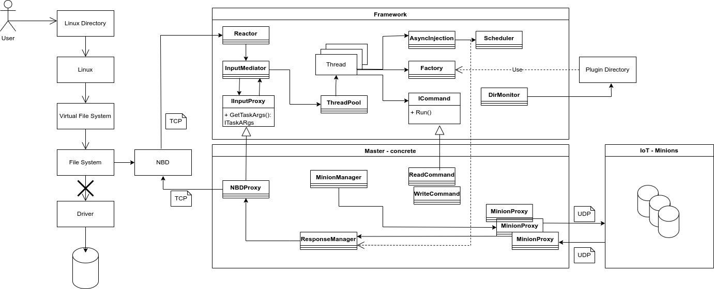

# IoT-Based-Drive
My project utilizes existing IoT devices’ to create a drive on the local network for data and backup storage. 

1. System Overview

    In the modern world, where the internet has become a large part of our lives, many home devices and appliances have integrated processors, memory and even networking capabilities. This has led to the idea of IoT(internet of things) and smart homes, where home devices are connected through a local network to allow central control and intercommunication.
    IoT has grown in popularity in recent years with predictions anticipating exponential growth in the near future. However, alongside the growing use of the internet, data security vulnerabilities have also grown.
    Our product utilizes existing IoT devices’ to create a NAS(network-attached storage) on the local network for data and backup storage. This is done by installing a small module with local storage on each IoT device, and treating them as a single RAID01 drive which is only accessible in the local network and by our dedicated software. 
    storing data this way creates several layers of security: 
        • secure access to the local network
        • secure access to the NAS through dedicated software 
        • hidden order of individual device storage in the NAS
    Using the RAID01 (also known as RAID 0+1 or nested RAID) protocol, where we mirror striped data across multiple devices, we guarantee data availability in cases where a device fails. When a device goes offline, the redundant copy ensures that data remains accessible without interruption.

2. Design Requirements

    2.1 Functional Requirements
        * IoT-based NAS/RAID01 Drive
        * GUI Interaction
        * IoT Physical Disks - The physical storage units will be implemented as IoT devices.
        * Plugin System - The system will support addition of future extensions and updates through a plugin architecture that can modify the system during runtime.
        * Reliability and Error Handling

    2.2 Non-Functional Requirements
        * Generic Architecture
        * Modularity and Code Reuse
        * Framework Implementation
        * Concurrency Support
        * The framework will be fully portable and implemented using modern C++ with standard libraries.

3. Block Diagram

Block Diagram Flow: 

    1. User requests access to data stored on the NAS, using the Linux directory GUI.
    2. The Linux OS manages the user’s request and interacts with the Virtual File System (VFS).
    3. The VFS passes the request to the appropriate File System.
    4. The File System manages how data is stored and retrieved from the storage devices. It then redirects the command into the NBD Client instead of the default driver. 
    5.  The NBD-Client and Server  pass the request to the Master. 
    6. The Master Unit is a central controller that manages, coordinates, and controls access to data on the NAS. When the user’s request arrives at the master, it processes the request and sends the relevant data to be written to or read from the disk by the appropriate Minions.
    7. The Minions are IoT Devices that send and receive data to store or to be stored on them respectively. 

